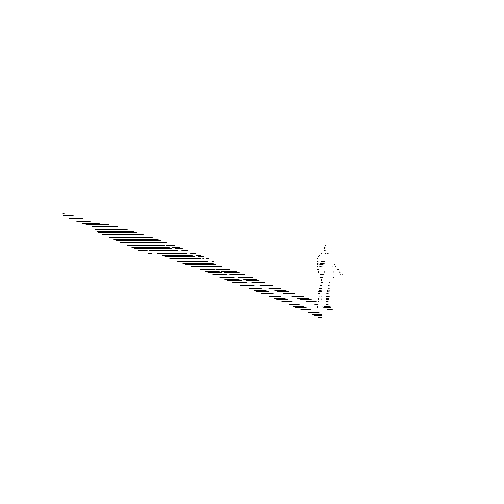
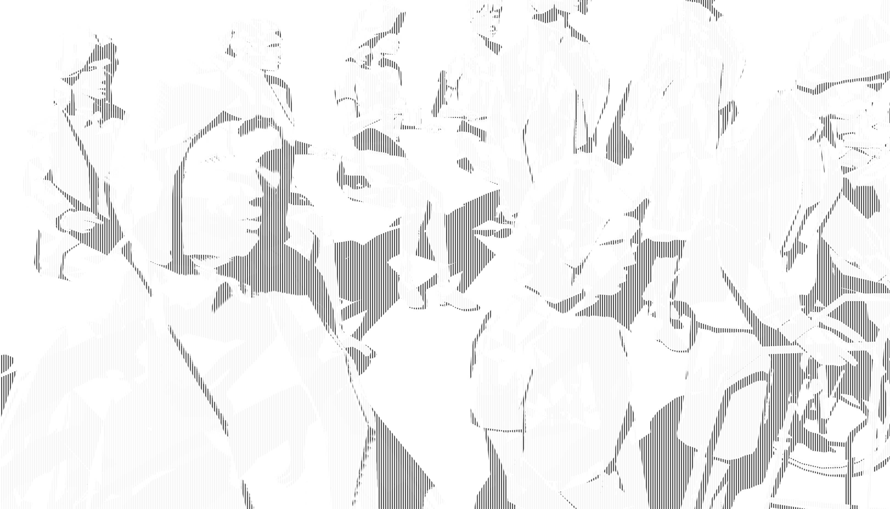

This is a new animation made using my "shader" built in Rhinoceros3D.

It is technically more of a pixel art filter, that takes a raytraced light condition and summarizes it as a set of color pixels that shift as the camera moves.

While the future is unknown, there are many rendering applications like blender that may use this system.

These two new vectorized studies enable a new version of the shader which is available as a .ini in this folder on github.

